# GenForge LangGraph Architecture

This flowchart replicates the system design provided in your reference image, mapped to the actual implementation in the codebase.

```mermaid
graph LR
    %% Entry Point
    Agent([Agent])

    %% PATH 1: FIRST PROMPT (Generation & Ingestion)
    Agent --- Path1
    subgraph Path1 [First Prompt - Project Generation]
        FP[First prompt] --> UP1[user prompt]
        UP1 --> LLM1[llm]
        LLM1 --> RES1[response]
        RES1 -- "Chunk the response acc. to <br/> generated code blocks" --> Split1{ }

        Split1 --> DB1[DB]
        DB1 --> FE1[frontend]

        Split1 --> VE1[vector embed]
        VE1 --> VDB1[vDB]
    end

    %% PATH 2: SECOND PROMPT (RAG Update)
    Agent --- Path2
    subgraph Path2 [Second Prompt - RAG Update]
        SP[Second Prompt] --> UP2[user Prompt]
        UP2 --> UPE[user prompt embed]
        UPE --> Search["Search in VDB and fetch the <br/> block of code from the normal DB"]
        Search --> Augment["Augment the user prompt with <br/> the block of code fetch from normal DB"]
        Augment --> LLM2[LLM]
        LLM2 --> RES2[Response]

        RES2 --> Split2{ }

        Split2 --> UPD_DB["Update the block of <br/> DB which got updated"]
        UPD_DB --> FE2[Show in the frontend]

        Split2 --> E_RES[Embed the result]
        E_RES --> UPD_VDB["Update the block of the <br/> VDB which was fetched"]
    end

    %% PATH 3: MANUAL EDIT (Monaco Editor Save)
    Agent --- Path3
    subgraph Path3 [Manual Editor Save - Direct Update]
        Monaco[User Edit in Monaco] --> Save[Save Request]
        Save --> DB_Upd[Update File in MongoDB]
        DB_Upd --> ReIndex_Man["Re-index File (Chunk + Embed)"]
        ReIndex_Man --> VDB_Upd[Update Vector DB]
        VDB_Upd --> Sync[Sync UI Content]
    end

    %% Styles to mimic the image feel
    style Agent fill:#333,stroke:#fff,stroke-width:2px,color:#fff
    style Path1 fill:transparent,stroke:#555,stroke-dasharray: 5 5
    style Path2 fill:transparent,stroke:#555,stroke-dasharray: 5 5
    style Path3 fill:transparent,stroke:#555,stroke-dasharray: 5 5
    
    %% Node styles
    style FP fill:#222,stroke:#ccc,color:#fff
    style LLM1 fill:#222,stroke:#ccc,color:#fff
    style LLM2 fill:#222,stroke:#ccc,color:#fff
    style RES1 fill:#222,stroke:#ccc,color:#fff
    style RES2 fill:#222,stroke:#ccc,color:#fff
    style Search fill:#222,stroke:#ccc,color:#fff
    style Augment fill:#222,stroke:#ccc,color:#fff
    style UPD_DB fill:#222,stroke:#ccc,color:#fff
    style UPD_VDB fill:#222,stroke:#ccc,color:#fff
    style Monaco fill:#222,stroke:#ccc,color:#fff
    style Save fill:#222,stroke:#ccc,color:#fff
    style DB_Upd fill:#222,stroke:#ccc,color:#fff
    style ReIndex_Man fill:#222,stroke:#ccc,color:#fff
    style VDB_Upd fill:#222,stroke:#ccc,color:#fff
```

## Mapping to Codebase

- **Agent / First Prompt**: Handled by `src/agents/core/graphAgent.js` (LangGraph loop).
- **Chunk / Vector Embed**: Handled by `src/services/projectService.js` and `src/services/ragService.js` (`reIndexFile`).
- **Second Prompt / Search**: Handled by `src/services/ragService.js` (`findRelevantCode`).
- **Augment / LLM Response**: Handled by `src/services/ragService.js` (`generatePatch`).
- **Update DB / VDB**: Handled by `src/services/ragService.js` (`applyPatch` and `reIndexFile`).
