# GenForge Project Flowcharts

This document describes the core logic of the GenForge application, focusing on the LangGraph-based node architecture for project generation, RAG-based updates, and manual saves.

## 1. High-Level Flowchart (LangGraph Architecture)

```mermaid
flowchart TD
    %% ─────────────────────────────────────────────────────────────────────────────
    %% PATH 1: FIRST PROMPT (GENERATION)
    %% ─────────────────────────────────────────────────────────────────────────────
    subgraph Path1 [First Prompt Generation & Ingestion]
        P1Start([User Prompt]) --> P1Rec[receivePromptNode]
        P1Rec --> P1Graph[[Inner StateGraph Loop]]
        
        subgraph P1Loop [callLLMNode: Agent Logic]
            P1Agent[agentNode] <--> P1Tools[toolsNode: executeCommand]
        end
        
        P1Graph --> P1Chunk[chunkResponseNode]
        P1Chunk --> P1DB[(saveToDBNode: MongoDB)]
        P1DB --> P1Embed[vectorEmbedNode: OpenRouter Embeddings]
        P1Embed --> P1VDB[(saveToVDBNode: Atlas Vector Search)]
        P1VDB --> P1Done([Project Created])
    end

    %% ─────────────────────────────────────────────────────────────────────────────
    %% PATH 2: SECOND PROMPT (RAG UPDATE)
    %% ─────────────────────────────────────────────────────────────────────────────
    subgraph Path2 [Second Prompt RAG Update]
        P2Start([User Request]) --> P2Rec[receivePromptNode]
        P2Rec --> P2PromptEmbed[embedPromptNode: OpenRouter Embeddings]
        P2PromptEmbed --> P2Search[searchVDBNode: Atlas Vector Search]
        P2Search -- No Chunks found --> P2End([Short Circuit End])
        P2Search -- Chunks found --> P2Aug[augmentPromptNode]
        
        P2Aug --> P2LLM[callLLMNode: OpenRouter LLM]
        P2LLM --> P2Clean[chunkResponseNode: Strip Markdown]
        P2Clean --> P2UpdateDB[(updateDBNode: Save to MongoDB)]
        P2UpdateDB --> P2ResEmbed[embedResultNode: OpenRouter Embeddings]
        P2ResEmbed --> P2UpdateVDB[(updateVDBNode: Replace Vectors)]
        P2UpdateVDB --> P2UpdateDone([Project Updated])
    end

    %% ─────────────────────────────────────────────────────────────────────────────
    %% PATH 3: MANUAL EDITOR SAVE
    %% ─────────────────────────────────────────────────────────────────────────────
    subgraph Path3 [Manual Editor Save]
        P3Start([User Save in Monaco]) --> P3Rec[receiveEditNode]
        P3Rec --> P3UpdateDB[(updateDBNode: Save to MongoDB)]
        P3UpdateDB --> P3ReIndex[reIndexNode: Chunks & OpenRouter Embeddings]
        P3ReIndex --> P3UpdateVDB[(updateVDBNode: Replace Vectors)]
        P3UpdateVDB --> P3Sync[syncUINode]
        P3Sync --> P3SaveDone([File Saved])
    end

    %% Styling
    style Path1 fill:#f0f7ff,stroke:#007bff
    style Path2 fill:#fff5eb,stroke:#f97316
    style Path3 fill:#f3f4f6,stroke:#6b7280
    style P1Graph fill:#dbeafe,stroke:#3b82f6,stroke-width:2px
    style P2Search fill:#ffedd5,stroke:#fb923c,stroke-width:2px
```

## 2. Path 1 Detailed: Generation & Ingestion Logic

The Generation Path uses a **planning-execution agent loop**. It decomposes the user's high-level request into specific terminal commands (`mkdir`, `New-Item`, `Set-Content`). Once the generation is complete, the resulting files are persisted to MongoDB and indexed into Atlas Vector Search for future RAG operations.

- **State Management**: Uses shared state channels via `sharedState.js`.
- **Streaming**: Progress updates (folder creation, file writes) are streamed to the frontend via SSE.
- **Tools**: The agent uses an `executeCommand` tool which simulates terminal output.

## 3. Path 2 Detailed: RAG-based Code Update

The RAG Path enables users to update existing projects using natural language. It leverages vector search to find relevant file chunks, provides those chunks to the LLM as context, and applies the resulting patches.

- **Context Retrieval**: Uses `$vectorSearch` with Atlas to find the most relevant code blocks.
- **Context Augmentation**: Builds a prompt combining the user's request with the retrieved code.
- **Incremental Indexing**: Only nodes for the modified files are re-embedded and updated in the VDB.

## 4. Path 3 Detailed: Manual Monaco Save

When a user manually edits a file in the Monaco editor and hits save, this path ensures the vector database stays in sync with the database record.

- **Direct Update**: Skips LLM involvement and updates MongoDB immediately.
- **Automatic Re-indexing**: Re-chunks and re-embeds the updated content for accurate future RAG search.
