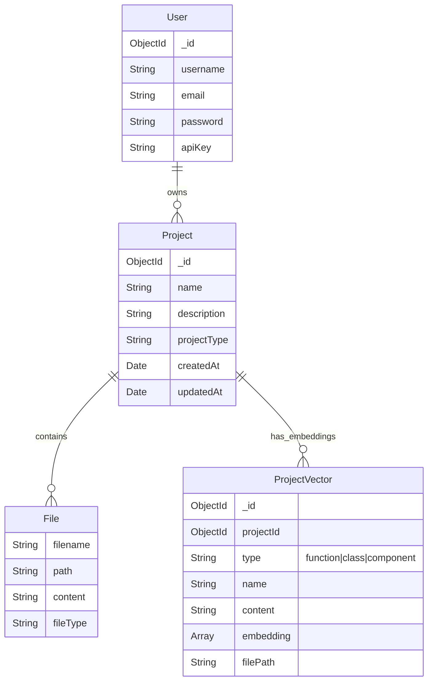

# GenForge

GenForge is an advanced AI-powered full-stack web application generator. It leverages the power of Google's Gemini models to autonomously design, code, and deploy web applications based on natural language prompts. Beyond simple code generation, GenForge features a sophisticated RAG (Retrieval-Augmented Generation) pipeline that maintains contextual awareness of the generated codebase, enabling iterative improvements and complex feature additions.

## 🚀 Features

-   **AI-Driven Development**: Generates full-stack React/Node.js applications from simple text descriptions using Gemini 2.0 Flash.
-   **Virtual IDE**: Integrated browser-based environment with a virtual file system, Monaco editor, and terminal.
-   **Real-Time Preview**: Instant live preview of the generated application.
-   **Context-Aware RAG**: Uses a dual-database architecture to index and retrieve code chunks, allowing the AI to understand and modify existing code intelligently.
-   **Secure Authentication**: Robust user management with encrypted API key storage.
-   **Project Management**: Dashboard to manage, resume, and delete generated projects.

## 🛠️ Tech Stack

### Frontend
-   **Framework**: React (Vite)
-   **Styling**: TailwindCSS
-   **Editor**: Monaco Editor
-   **Icons**: Lucide React

### Backend
-   **Runtime**: Node.js
-   **Framework**: Express.js
-   **Database**: MongoDB (Local for application data, Atlas for Vector Search)
-   **AI Orchestration**: LangChain, LangGraph
-   **AI Models**: Google Gemini 2.0 Flash (Generation), Gemini Embedding-001 (Vectorization)

## 🔄 Workflow & Architecture

GenForge operates on a sophisticated pipeline that bridges user intent with executable code.

### 1. Prompt to Creation (The Generation Flow)
When a user enters a prompt (e.g., "Create a to-do list app"):
1.  **Request Handling**: The prompt is sent to the `/api/generate-prompt` endpoint.
2.  **Agent Orchestration**: The backend initializes a Gemini-powered agent.
3.  **Plan & Execute**: The agent generates a plan and outputs a structured JSON containing:
    -   `fileOperations`: A list of files to create (HTML, CSS, JS) with their content.
    -   `messages`: Assistant responses describing the actions.
4.  **Persistence**: The server saves these files directly to the **Local MongoDB** `Project` collection.
5.  **Response**: The structured project data is returned to the frontend.

### 2. Prompt to Update (The RAG Flow)
When a user asks to modify an existing project (e.g., "Add a delete button"):
1.  **Ingestion (Background)**:
    -   The `langgraph_index.js` pipeline retrieves the latest project files from Local MongoDB.
    -   **Semantic Chunking**: Gemini analyzes code files and splits them into logical units (functions, classes).
    -   **Vectorization**: These chunks are embedded using `embedding-001`.
    -   **Indexing**: Vectors are stored in **MongoDB Atlas** for high-speed retrieval.
2.  **Context Retrieval**: The system queries Atlas for code chunks relevant to "delete button".
3.  **Context Injection**: The retrieved code snippets are injected into the agent's prompt context.
4.  **Informed Generation**: Gemini generates the specific code changes needed, respecting the existing variable names and structure.
5.  **Update**: The changes are applied to the files in Local MongoDB.

### 3. Generation to Preview (The Virtual Runtime)
How the code comes to life in the browser without a build step:
1.  **Virtual File System**: The frontend (`RightPanel.jsx`) maintains a state of all project files.
2.  **Dependency Resolution**:
    -   The system identifies the entry point (usually `index.html`).
    -   It parses the HTML to find `<link>` (CSS) and `<script>` (JS) tags.
3.  **Inline Injection**:
    -   External CSS files are replaced with `<style>` blocks containing the actual CSS content.
    -   External JS files are replaced with `<script>` blocks containing the actual JS content.
4.  **Sandboxed Rendering**: The fully assembled HTML string is injected into an `iframe` using the `srcDoc` attribute. This creates a secure, isolated environment where the app runs exactly as it would on a real server.

## 📊 Database Schema (ER Diagram)

The system uses a relational structure within MongoDB to manage users, projects, and their associated vector embeddings.



## ⚙️ RAG Implementation Details

The RAG system is designed to minimize resource usage while maximizing context quality.

-   **Dual-Database Strategy**:
    -   **Local MongoDB**: Stores the actual file content and project metadata for fast read/write operations during development.
    -   **MongoDB Atlas**: Dedicated to storing high-dimensional vectors. This separation ensures that heavy vector search operations do not impact the performance of the local development server.
-   **Semantic Chunking**: Instead of fixed-size chunking (which often breaks code logic), GenForge asks Gemini to parse the code and return logical blocks. This results in higher quality retrieval as the AI gets complete functions or components as context.
-   **LangGraph Integration**: The ingestion pipeline is built as a state graph (`langgraph_index.js`), making the process observable, resilient, and easy to extend.

## 📦 Installation & Setup

### Prerequisites
-   Node.js (v18+)
-   MongoDB (Local instance running on port 27017)
-   MongoDB Atlas Account (for Vector Search)
-   Google Cloud API Key (with Gemini access)

### Environment Variables
Create a `.env` file in the root directory:

```env
PORT=8080
MONGO_URI=mongodb://localhost:27017/genforge
MONGODB_URI_VECTOR=mongodb+srv://<username>:<password>@<cluster>.mongodb.net/genforge
GOOGLE_API_KEY=your_gemini_api_key
SESSION_SECRET=your_secret_key
CLIENT_ORIGIN=http://localhost:5173
```

### Steps

1.  **Clone the repository**
    ```bash
    git clone https://github.com/yourusername/genforge.git
    cd genforge
    ```

2.  **Install Dependencies**
    ```bash
    npm install
    cd GenforgeFrontend
    npm install
    cd ..
    ```

3.  **Start the Backend**
    ```bash
    npm start
    ```

4.  **Start the Frontend** (in a new terminal)
    ```bash
    cd GenforgeFrontend
    npm run dev
    ```

5.  **Access the Application**
    Open `http://localhost:5173` in your browser.

## 🤝 Contributing

Contributions are welcome! Please fork the repository and submit a pull request for any enhancements or bug fixes.

## 📄 License

This project is licensed under the MIT License.
