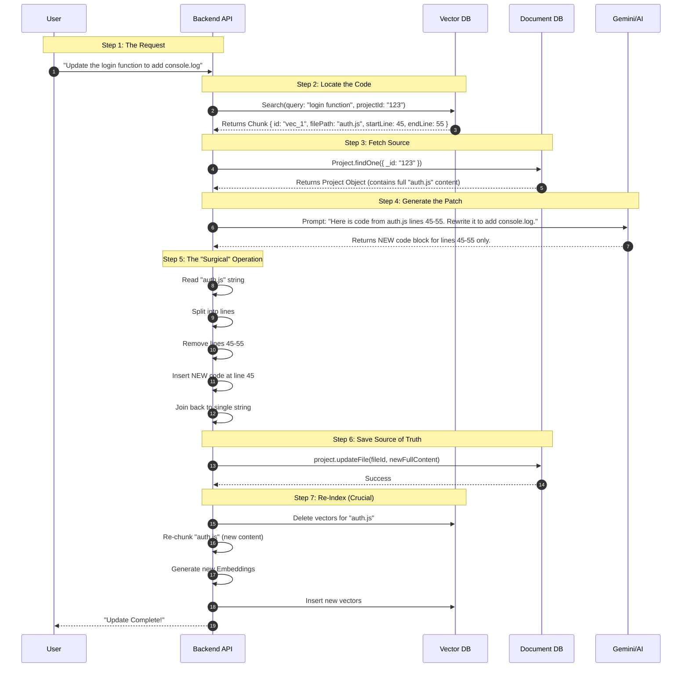

# GenForge

GenForge is an advanced AI-powered full-stack web application generator. It leverages the power of Google's Gemini models to autonomously design, code, and deploy web applications based on natural language prompts. Beyond simple code generation, GenForge features a sophisticated RAG (Retrieval-Augmented Generation) pipeline that maintains contextual awareness of the generated codebase, enabling iterative improvements and complex feature additions.

## 🚀 Features

-   **AI-Driven Development**: Generates full-stack React/Node.js applications from simple text descriptions using Gemini 2.5 Flash.
-   **Virtual IDE**: Integrated browser-based environment with an in-memory file system, Monaco editor, and terminal.
-   **Real-Time Preview**: Instant live preview of the generated application.
-   **Context-Aware RAG**: Uses a dual-database architecture (Document DB + Vector DB) to index and retrieve code chunks, allowing the AI to understand and modify existing code intelligently.
-   **Secure Authentication**: Robust user management with encrypted API key storage.
-   **Project Management**: Dashboard to manage, resume, and delete generated projects.

## 🛠️ Tech Stack

### Frontend
-   **Framework**: React (Vite)
-   **Styling**: TailwindCSS
-   **Editor**: Monaco Editor
-   **Icons**: Lucide React

### Backend
-   **Runtime**: Node.js
-   **Framework**: Express.js
-   **Database**: 
    -   **Document DB**: MongoDB (Primary storage for application data and project files)
    -   **Vector DB**: MongoDB Atlas Vector Search (Storage for code embeddings)
-   **AI Orchestration**: LangChain, LangGraph
-   **AI Models**: Google Gemini 2.5 Flash (Generation), Gemini Embedding-004 (Vectorization)

## 🔄 Workflow & Architecture

GenForge operates on a sophisticated pipeline that bridges user intent with executable code.

### 1. Prompt to Creation (The Generation Flow)
When a user enters a prompt (e.g., "Create a to-do list app"):
1.  **Request Handling**: The prompt is sent to the `/api/generate-prompt` endpoint.
2.  **Agent Orchestration**: The backend initializes a Gemini-powered agent.
3.  **Plan & Execute**: The agent generates a plan and outputs a structured JSON containing:
    -   `fileOperations`: A list of files to create (HTML, CSS, JS) with their content.
    -   `messages`: Assistant responses describing the actions.
4.  **Persistence**: The server saves these files directly to the **Document DB** `Project` collection.
5.  **Response**: The structured project data is returned to the frontend.

### 2. Prompt to Update (The RAG Flow)
When a user asks to modify an existing project (e.g., "Add a delete button"):
1.  **Ingestion (Background)**:
    -   The `GenForgeBackend/services/ragIngestion.js` pipeline retrieves the latest project files from the Document DB.
    -   **Semantic Chunking**: Gemini analyzes code files and splits them into logical units (functions, classes).
    -   **Vectorization**: These chunks are embedded using `embedding-004`.
    -   **Indexing**: Vectors are stored in the **Vector DB** for high-speed retrieval.
2.  **Context Retrieval**: The system queries the Vector DB for code chunks relevant to "delete button".
3.  **Context Injection**: The retrieved code snippets are injected into the agent's prompt context.
4.  **Informed Generation**: Gemini generates the specific code changes needed, respecting the existing variable names and structure.
5.  **Update**: The changes are applied to the files in the Document DB using the "Read-Patch-Sync" strategy.

### 3. Generation to Preview (The Virtual Runtime)
How the code comes to life in the browser without a build step:
1.  **In-Memory File State**: The frontend (`RightPanel.jsx`) maintains a local state of all project files, acting as a lightweight client-side file system.
2.  **Dependency Resolution**:
    -   The system identifies the entry point (usually `index.html`).
    -   It parses the HTML to find `<link>` (CSS) and `<script>` (JS) tags.
3.  **Inline Injection**:
    -   External CSS files are replaced with `<style>` blocks containing the actual CSS content.
    -   External JS files are replaced with `<script>` blocks containing the actual JS content.
4.  **Sandboxed Rendering**: The fully assembled HTML string is injected into an `iframe` using the `srcDoc` attribute. This creates a secure, isolated environment where the app runs exactly as it would on a real server.

## 🧠 RAG Implementation: The "Read-Patch-Sync" Strategy

To achieve precise code updates without rewriting entire files or losing context, we use a **Read-Patch-Sync** architecture. This approach bridges the gap between the **Search Index** (Vector DB) and the **Source of Truth** (Document DB).

Since the Document DB stores the *entire* file content as a single string, we cannot simply "update a line" in the database directly. We must read the full file, modify it in the application layer (Node.js), and save the full file back.

### Architecture Workflow



### Detailed Step-by-Step Breakdown

1.  **User Prompt**: The user sends a natural language request (e.g., "Change the `calculateTotal` function to include tax.").
2.  **Vector Search (The "Locator")**: The system queries the **Vector DB** to find the location of the relevant code (e.g., `src/utils/math.js`, lines 10-20).
3.  **Fetch Source (The "Patient")**: The system retrieves the actual file content from the **Document DB**.
4.  **LLM Generation (The "Surgeon")**: The system asks the LLM to rewrite *only* the specific part identified in Step 2.
5.  **Patching (The "Operation")**: The application server performs the splice operation in memory, replacing the old lines with the new code.
6.  **Save Source (The "Stitches")**: The modified full string is saved back to the **Document DB**.
7.  **Re-Index (The "Recovery")**: The **Vector DB** is updated to reflect the changes, ensuring future searches are accurate.

### Implementation Logic

The patching function simulates a "Cursor-like" edit in memory:

```javascript
/**
 * Simulates a "Cursor-like" edit in memory
 * @param {string} fullContent - The entire file content from Document DB
 * @param {number} startLine - 1-based start line
 * @param {number} endLine - 1-based end line
 * @param {string} newCode - The code to insert
 */
function applyLinePatch(fullContent, startLine, endLine, newCode) {
    const lines = fullContent.split('\n');
    
    // Convert 1-based to 0-based index
    const startIndex = startLine - 1;
    const deleteCount = endLine - startLine + 1;
    
    // The "Splice" Magic
    // Remove 'deleteCount' lines starting at 'startIndex' and insert 'newCode'
    lines.splice(startIndex, deleteCount, newCode);
    
    return lines.join('\n');
}
```

## 📦 Installation & Setup

### Prerequisites
-   Node.js (v18+)
-   MongoDB (Document DB instance running on port 27017)
-   MongoDB Atlas Account (for Vector DB)
-   Google Cloud API Key (with Gemini access)

### Environment Variables
Create a `.env` file in the `GenForgeBackend` directory:

```env
PORT=8080
MONGO_URI=mongodb://localhost:27017/genforge
VECTOR_DB=mongodb+srv://<username>:<password>@<cluster>.mongodb.net/genforge
GOOGLE_API_KEY=your_gemini_api_key
SESSION_SECRET=your_secret_key
CLIENT_ORIGIN=http://localhost:5173
```

### Steps

1.  **Clone the repository**
    ```bash
    git clone https://github.com/yourusername/genforge.git
    cd genforge
    ```

2.  **Install Dependencies**
    ```bash
    cd GenForgeBackend
    npm install
    cd ../GenforgeFrontend
    npm install
    cd ..
    ```

3.  **Start the Backend**
    ```bash
    cd GenForgeBackend
    npm start
    ```

4.  **Start the Frontend** (in a new terminal)
    ```bash
    cd GenforgeFrontend
    npm run dev
    ```

5.  **Access the Application**
    Open `http://localhost:5173` in your browser.

## 📄 License

This project is licensed under the MIT License.
